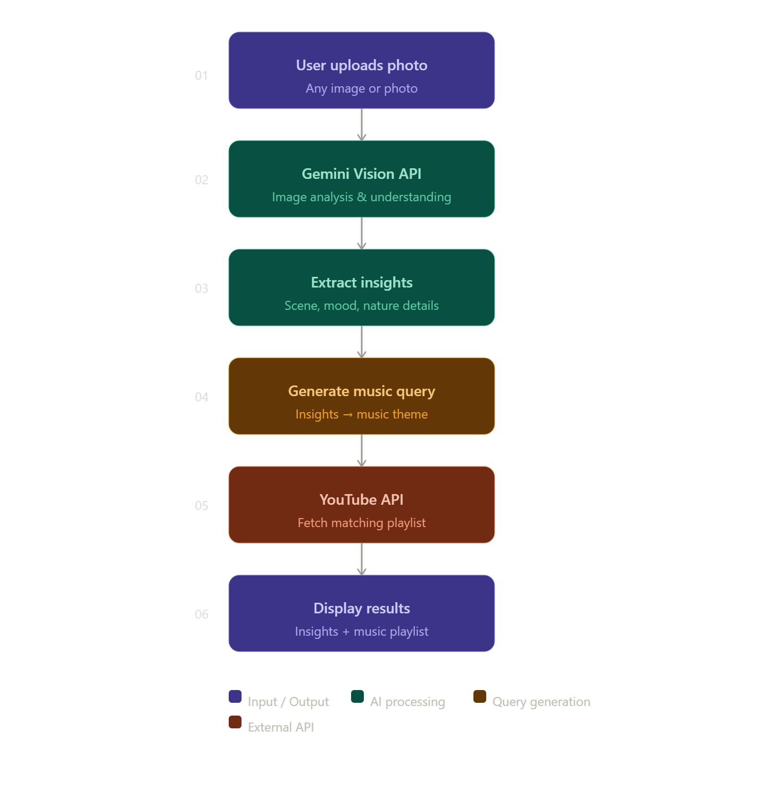

# NatureFlow - AI-Powered Nature Insights with Curated Music

## Description

NatureFlow is an intelligent web application that transforms the way users connect with nature. Upload photos of your surroundings, and our AI (powered by Gemini Vision) analyzes them to deliver personalized insights about the natural elements, ecosystems, and environmental characteristics. Beyond analysis, NatureFlow curates a custom music playlist from YouTube that perfectly complements your nature moment, creating a holistic sensory experience.

## Project Links

- **Devpost**: [https://devpost.com/software/natureflow](https://devpost.com/software/natureflow)
- **Live Link**: [https://nature-flow.vercel.app](https://nature-flow.vercel.app)
- **Demo Video**: [Coming Soon]

## What It Does

1. **AI Photo Analysis** - Upload photos of your surroundings and receive intelligent analysis powered by Google's Gemini Vision API
2. **Nature Insights** - Get personalized information about plants, animals, weather patterns, and environmental data in your photos
3. **Smart Playlist Generation** - Automatically generates a curated music playlist from YouTube that matches the mood and theme of your nature experience
4. **Seamless Integration** - Enjoy a smooth, intuitive interface that combines image analysis, insights, and music discovery in one beautiful application

---

## Core Features

1. **Image Upload & Processing** - Users upload photos which are validated, converted to base64, and sent to the backend for intelligent analysis
2. **Gemini Vision Analysis** - Backend sends images to Google's Gemini Vision API, which returns structured JSON with flora, fauna, weather, ecosystem, and mood data
3. **Smart Playlist Generation** - Using mood and ecosystem data from Gemini, the backend queries YouTube Data API to curate a music playlist matching the ambiance
4. **Real-time Insights Display** - Frontend renders detailed nature insights organized by species, weather, ecosystem type, and environmental characteristics
5. **Embedded Music Player** - YouTube videos are embedded via IFrame API, allowing users to preview and play curated music without leaving the app

---

## Architecture



## Tools Used

- **Gemini Vision API** - Advanced image analysis to identify natural elements, weather, wildlife, and environmental data from uploaded photos
- **YouTube API** - Retrieves and curates music playlists based on the nature insights and mood extracted from images
- **Vercel** - Hosting platform for seamless deployment and fast, reliable access to the live application

---

## Setup and Development

### Prerequisites

1. **Gemini API Key** - Get from [Google AI Studio](https://makersuite.google.com/app/apikey)
2. **YouTube API**

### Installation

1. **Clone the repository**
   ```bash
   git clone https://github.com/parthodas23/nature-flow.git
   cd nature-flow
    ```

2. **Install dependencies**

   ```bash
   npm install
   ```

3. **Set up environment variables**

   Create a `.env.local` file in the root directory and add:

   ```env
   GEMINI_API_KEY=your_gemini_api_key
   ```

4. **Run the development server**

   ```bash
   npm run dev
   ```
5. **Access the app**
    Open [http://localhost:5173](http://localhost:5173) in your browser to see the app in action.